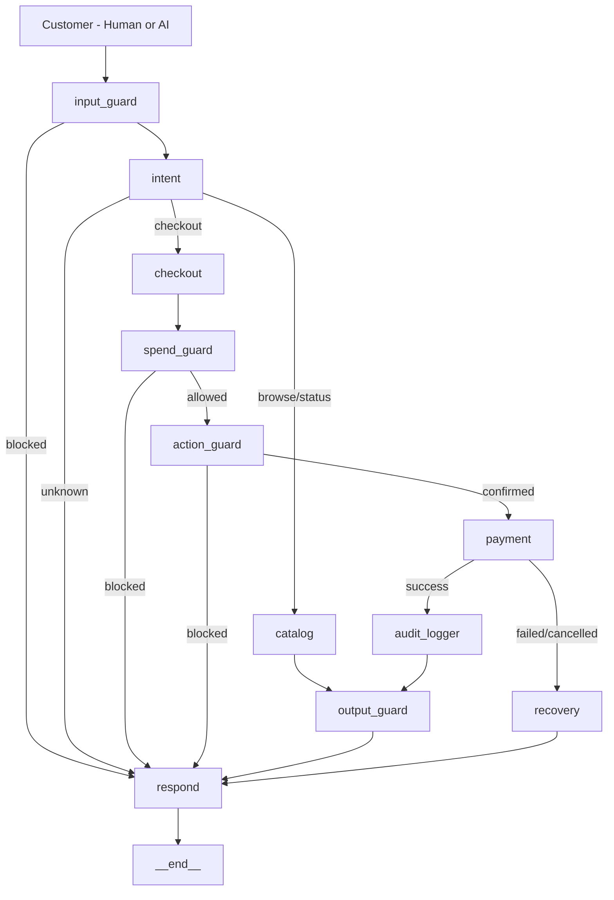

# RazorFlow AI

> **When a customer says "buy it", RazorFlow AI makes it happen for humans and AI buyers alike.**

**Track 01 — AI Growth & Agentic Commerce | Razorpay AI Buildathon 2026**

---

## Why It Matters

Checkout forms are built for humans. But AI agents are starting to buy things on behalf of users and protocols like NPCI UAP, ACP, and x402 are making agent-to-agent commerce the open problem of the year.

Merchants need to be discoverable and transactable by machines, not just people. When an AI agent wants to buy something, it needs:
- A machine-readable catalog it can parse
- A natural language interface it can drive
- A payment system it can trust
- Proof that every rupee is bounded and auditable

RazorFlow AI provides all four on top of Razorpay's test-mode APIs.

---

## What Is Built

| Capability | Implementation |
|-----------|---------------|
| Conversational checkout | Natural language shopping — no forms, no dropdowns |
| Agent-readable catalog | `/api/catalog/agent/discover` with `razorpay-agentic-v1` protocol, `buy_intent` strings, `price_integrity` declaration |
| Upsell & cross-sell agent | After every add-to-cart, agent recommends complementary products to grow merchant AOV |
| Spend limit enforcement | Hard cap enforced in code — LLM cannot override, prompt injection cannot bypass |
| Complete audit trail | Every node decision logged with timestamp — every money action explainable |
| Merchant revenue dashboard | Real-time AOV, upsell rate, agent-driven revenue % — persisted in SQLite DB |
| A2A commerce | AI buyer discovers catalog, selects product, pays via Razorpay — zero human involvement |
| Security guardrails | Injection detection, leetspeak normalization, PII scrubbing, price validation |
| Evaluation suite | 119 adversarial test cases — 98.3% overall, 100% on guardrails/payment/intent |

---


## Architecture



**10 specialized nodes — each with a single responsibility:**

| Node | Purpose |
|------|---------|
| input_guard | Blocks injections, toxic content, leetspeak normalization |
| intent | Classifies browse / checkout / status / unknown |
| catalog | Handles browsing, cart, budget queries, upsell |
| checkout | Builds order summary |
| spend_guard | Enforces spend cap at code level — not prompt level |
| action_guard | Confirms payment with user |
| payment | Calls Razorpay API, creates real order |
| audit_logger | Logs every decision with timestamp |
| output_guard | Scrubs PII, validates prices against catalog DB |
| recovery | Handles failed/cancelled payments gracefully |

---

## How It Works

### For Human Buyers

```
User:  "show me phones under 30000"
Agent: Shows Redmi Note 13 Pro at ₹26,999

User:  "add it"
Agent: Added. Cart ₹26,999
       💡 You might also like: Fastrack Reflex Beat

User:  "also add fastrack"
Agent: Added. Cart ₹29,994

User:  "buy it"
Agent: Payment successful. Order ID: order_xyz
       You have ₹70,006 remaining.
       Samsung Galaxy Watch 6 fits your budget at ₹29,999.
       Would you like to add it?
```

Every rupee tracked. Every decision in the audit trail.

### For AI Buyers (A2A)

Any AI agent can:
1. Read catalog: `GET /api/catalog/agent/discover`
2. Create session: `POST /api/session/create`
3. Add to cart: `POST /api/chat` → `"add {product} to cart"`
4. Pay: `POST /api/chat` → `"buy it"`
5. Receive structured JSON confirmation with `order_data`

No human involved. This is what NPCI UAP enables.

---

## Safety Model

1. **Prices are always from the catalog database.** The LLM never sets, modifies, or suggests prices. Declared explicitly via `price_integrity` field in the A2A catalog.
2. **Spend limit is enforced in code.** The LLM cannot override it. Prompt injection cannot bypass it.
3. **Payment requires explicit user confirmation.** The agent never auto-pays without intent.
4. **Every money action is logged.** Audit trail is append-only, timestamped, and visible in the UI.
5. **Input validation runs before any LLM call.** Malicious input never reaches the model.
6. **Output is validated before delivery.** PII scrubbed. Prices cross-checked against DB.

---

## What Razorpay Asked For

| Requirement | Status |
|-------------|--------|
| Conversational checkout | ✅ Natural language flow|
| Agent-readable catalog | ✅ /api/catalog/agent/discover |
| Upsell & cross-sell | ✅ After every add to cart |
| Every money action explainable | ✅ Complete audit trail |
| Bounded | ✅ Spend limit enforced at code level |
| Gated | ✅ Input guard + spend guard + action guard |
| One failure handled gracefully | ✅ Out of stock, spend exceeded, duplicate order |
| Razorpay test-mode APIs | ✅ Real order IDs generated |

---

## Evaluation Results

```
GUARDRAILS    30/30  = 100%   (includes leetspeak attacks)
PAYMENT       10/10  = 100%
RECOVERY      10/10  = 100%
INTENT        51/51  = 100%
LLM_QUALITY   16/18  =  88.9% (independent judge: allam-2-7b)
─────────────────────────────
OVERALL      117/119 =  98.3%
```

---

## A2A Test Results (Live Server)

```
Test 1: Budget phone buyer (₹30,000)    → ✅ Redmi selected, paid
Test 2: Premium watch buyer (₹50,000)   → ✅ Apple Watch + upsell shown
Test 3: Multi-item buyer                → ✅ 2 items paid
Test 4: Spend limit enforcement         → ✅ Second payment correctly blocked
Test 5: Security (5 attacks)            → ✅ 5/5 blocked including leetspeak
```

---

## Tech Stack

| Layer | Technology |
|-------|-----------|
| Backend | FastAPI + LangGraph + SQLite |
| LLM | Groq (groq/compound + openai/gpt-oss-20b) |
| Payment | Razorpay SDK (test mode) |
| Frontend | React + Vite + Tailwind CSS |
| Deployment | Render + Vercel |
| Evals | Custom suite + LLM-as-judge (allam-2-7b) |

---

## Product Catalog — 20 Products, 4 Categories

| Category | Products |
|----------|---------|
| Phones | iPhone 15, Samsung Galaxy S24, Google Pixel 8, OnePlus 12, Redmi Note 13 Pro |
| Shoes | Nike Air Max 270, Adidas Ultraboost 23, New Balance 574, Skechers Go Walk 6 |
| Bags | Safari Trolley, American Tourister, Wildcraft, Lavie, Skybags |
| Watches | Apple Watch Series 9, Samsung Galaxy Watch 6, Fastrack, Titan Edge, Noise ColorFit |

Puma RS-X is intentionally out of stock — demonstrates graceful failure handling with alternatives.

---

## How to Run Locally

```bash
# Backend
cd backend
pip install -r requirements.txt
cp .env.example .env   # add your keys
uvicorn main:app --reload

# Frontend
cd frontend
npm install
npm run dev
```

**Environment variables:**

| Variable | Purpose |
|----------|---------|
| GROQ_API_KEY | Groq LLM API key |
| RAZORPAY_KEY_ID | Razorpay test mode key ID |
| RAZORPAY_KEY_SECRET | Razorpay test mode secret |
| SPEND_LIMIT_DEFAULT | Default spend cap (e.g. 100000) |
| SESSION_EXPIRY_MINUTES | Session timeout (e.g. 30) |

---

## Testing

```bash
# A2A commerce test (live server)
python tests/test_a2a.py

# Advanced natural language + security test
python tests/advanced_test.py

# Full eval suite
python evals/eval_report.py
```

---

## Project Structure

```
backend/
├── agent/
│   ├── nodes/          # 10 LangGraph nodes
│   ├── edges/          # routing logic
│   └── tools/          # Razorpay tools
├── api/
│   ├── chat.py         # main chat endpoint
│   ├── catalog.py      # catalog + A2A discovery
│   └── analytics.py    # merchant revenue dashboard
├── validators/         # input / output / spend guards
├── db/                 # SQLite models + session store
├── evals/              # eval suite (98.3%)
└── tests/              # test files

frontend/
└── src/
    ├── components/     # UI components
    └── hooks/          # API hooks
```

---

## Buildathon Package

| Asset | Location |
|-------|---------|
| Architecture diagram | [README.md](README.md) (mermaid) |
| Failure postmortem | [docs/FAILURE_POSTMORTEM.md](docs/FAILURE_POSTMORTEM.md) |
| Safety invariants | [docs/SAFETY_INVARIANTS.md](docs/SAFETY_INVARIANTS.md) |
| Video script | [docs/VIDEO_SCRIPT.md](docs/VIDEO_SCRIPT.md) |
| Product images | [docs/images/](docs/images/) |
| Buildathon criteria review | [docs/BUILDATHON_CRITERIA_REVIEW.md](docs/BUILDATHON_CRITERIA_REVIEW.md) |
| Submission checklist | [docs/SUBMISSION_CHECKLIST.md](docs/SUBMISSION_CHECKLIST.md) |

## Future Work

- Inventory reservation for concurrent buyers
- Webhook support for async order updates
- Agent identity framework (DID) for verified AI buyers
- Full NPCI UAP protocol compliance

---

*Built for Razorpay AI Buildathon 2026 — Track 01: AI Growth & Agentic Commerce*
