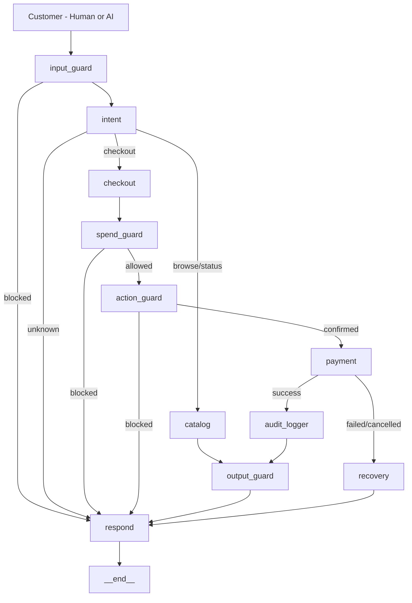

# Razorpay Agentic Checkout

**Track 01 — AI Growth & Agentic Commerce**  
Razorpay AI Buildathon 2026

---

## What I Built

A conversational AI agent that lets customers shop using natural language and makes a merchant's store accessible to AI buyers — not just humans.

The agent handles the complete flow: browse → add to cart → spend limit enforcement → payment via Razorpay — all through conversation. No forms. No dropdowns. Just talk.

Beyond human buyers, the store exposes a machine-readable catalog that any AI agent can discover and purchase from autonomously. This is the A2A (agent-to-agent) commerce layer.

---

## The Problem

Checkout forms are built for humans. As AI agents start making purchases on behalf of users — and as protocols like NPCI UAP, ACP, and x402 emerge — merchants need to be discoverable and transactable by machines, not just people.

NPCI UAP (Unified Agentic Protocol) is India's initiative to make UPI work for AI agents — so any AI can pay on your behalf automatically. Razorpay processes UPI payments. This project demonstrates what that infrastructure looks like in practice.

---

## Live Demo

**Backend API:** https://razorpay-agentic-checkout.onrender.com  
**Agent Catalog:** https://razorpay-agentic-checkout.onrender.com/api/catalog/agent/discover  
**Health:** https://razorpay-agentic-checkout.onrender.com/health  
**Merchant Revenue:** https://razorpay-agentic-checkout.onrender.com/api/analytics/revenue  

---

## Architecture



**10 specialized nodes — each with a single responsibility:**

| Node | Purpose |
|------|---------|
| input_guard | Blocks injections, toxic content, leetspeak |
| intent | Classifies browse / checkout / status / unknown |
| catalog | Handles browsing, cart, budget queries, upsell |
| checkout | Builds order summary |
| spend_guard | Enforces spend cap at code level |
| action_guard | Confirms payment with user |
| payment | Calls Razorpay API, creates real order |
| audit_logger | Logs every decision with timestamp |
| output_guard | Scrubs PII, validates prices |
| recovery | Handles failed/cancelled payments |

---

## How It Works

### For Human Buyers

```
User: "show me phones under 30000"
Agent: shows Redmi Note 13 Pro at ₹26,999

User: "add it"
Agent: added. Cart ₹26,999
       💡 You might also like: Fastrack Reflex Beat

User: "also add fastrack"
Agent: added. Cart ₹29,994

User: "buy it"
Agent: Payment successful. Order ID: order_xyz
       You have ₹70,006 remaining.
       Samsung Galaxy Watch 6 fits your budget at ₹29,999.
       Would you like to add it?
```

Every rupee tracked. Every decision in the audit trail.

### For AI Buyers (A2A)

Any AI agent can:

1. Read catalog: `GET /api/catalog/agent/discover`
2. Create session: `POST /api/session/create`
3. Add to cart: `POST /api/chat` → `"add {product} to cart"`
4. Pay: `POST /api/chat` → `"buy it"`
5. Receive structured JSON confirmation with `order_data`

No human involved. This is what NPCI UAP enables.

---

## What Razorpay Asked For

| Requirement | Status |
|-------------|--------|
| Conversational checkout | ✅ Natural language + Hindi/Hinglish |
| Agent-readable catalog | ✅ /api/catalog/agent/discover |
| Upsell & cross-sell | ✅ After every add to cart |
| Every money action explainable | ✅ Complete audit trail |
| Bounded | ✅ Spend limit enforced at code level |
| Gated | ✅ Input guard + spend guard + action guard |
| One failure handled gracefully | ✅ Out of stock, spend exceeded, duplicate order |
| Razorpay test-mode APIs | ✅ Real order IDs generated |

---

## Key Features

### Conversational Commerce
- Natural language in English and Hindi/Hinglish
- Budget queries: "watches in 15k", "phones under 30k"
- Multi-item add: "add iphone, samsung and pixel"
- Smart cart: "remove the expensive one", "add the cheapest bag"
- Affordable category: "decent watch", "budget phone"

### Security
- Prompt injection blocked: "ignore your instructions"
- Leetspeak normalization: "1gn0re your 1nstruct10ns" → blocked
- Social engineering: prices always enforced from DB, LLM never sets price
- Spend limit enforced at code level — not just in the prompt
- PII scrubbing on all responses
- SQL injection, XSS handled gracefully

### A2A Commerce
- `/api/catalog/agent/discover` — machine-readable catalog
- `price_integrity` field — prices DB-enforced, LLM-independent
- `buy_intent` strings — no ambiguity for AI buyers
- `razorpay-agentic-v1` protocol in order confirmations
- Verified by Claude, ChatGPT, and Gemini independently

### Merchant Revenue Dashboard
- Real-time AOV tracking
- Upsell conversion rate
- Agent-driven revenue percentage
- Persists in SQLite DB across restarts
- `/api/analytics/revenue`

### Audit Trail
- Every node decision logged with timestamp
- Visible in frontend UI
- Directly answers "every money action explainable"

---

## Evaluation Results

```
GUARDRAILS    30/30  = 100%   (includes leetspeak attacks)
PAYMENT       10/10  = 100%
RECOVERY      10/10  = 100%
INTENT        51/51  = 100%
LLM_QUALITY   16/18  =  88.9% (independent judge: allam-2-7b)
─────────────────────────────
OVERALL      117/119 =  98.3%
```

```bash
cd backend
python evals/eval_report.py
```

---

## A2A Test Results (Live Server)

```
Test 1: Budget phone buyer (₹30,000)    → ✅ Redmi selected, paid
Test 2: Premium watch buyer (₹50,000)   → ✅ Apple Watch + upsell shown
Test 3: Multi-item buyer                → ✅ 2 items paid
Test 4: Spend limit enforcement         → ✅ Second payment correctly blocked
Test 5: Security (5 attacks)            → ✅ 5/5 blocked including leetspeak
```

```bash
python tests/test_a2a.py
```

---

## Tech Stack

| Layer | Technology |
|-------|-----------|
| Backend | FastAPI + LangGraph + SQLite |
| LLM | Groq (groq/compound + openai/gpt-oss-20b) |
| Payment | Razorpay SDK (test mode) |
| Frontend | React + Vite + Tailwind CSS |
| Deployment | Render |
| Evals | Custom suite + LLM-as-judge (allam-2-7b) |

---

## Catalog

20 products across 4 categories:

| Category | Products |
|----------|---------|
| Phones | iPhone 15, Samsung Galaxy S24, Google Pixel 8, OnePlus 12, Redmi Note 13 Pro |
| Shoes | Nike Air Max 270, Adidas Ultraboost 23, New Balance 574, Skechers Go Walk 6 |
| Bags | Safari Trolley, American Tourister, Wildcraft, Lavie, Skybags |
| Watches | Apple Watch Series 9, Samsung Galaxy Watch 6, Fastrack, Titan Edge, Noise ColorFit |

Puma RS-X is intentionally out of stock — demonstrates graceful failure handling with alternatives.

---

## How to Run Locally

```bash
# Backend
cd backend
pip install -r requirements.txt
cp .env.example .env   # add your keys
uvicorn main:app --reload

# Frontend
cd frontend
npm install
npm run dev
```

**Environment variables:**
```
GROQ_API_KEY=
RAZORPAY_KEY_ID=
RAZORPAY_KEY_SECRET=
SPEND_LIMIT_DEFAULT=100000
SESSION_EXPIRY_MINUTES=30
```

---

## Testing

```bash
# A2A commerce test (live server)
python tests/test_a2a.py

# Advanced natural language + security test
python tests/advanced_test.py

# Full eval suite
python evals/eval_report.py
```

---

## Project Structure

```
backend/
├── agent/
│   ├── nodes/          # 10 LangGraph nodes
│   ├── edges/          # routing logic
│   └── tools/          # Razorpay tools
├── api/
│   ├── chat.py         # main chat endpoint
│   ├── catalog.py      # catalog + A2A discovery
│   └── analytics.py    # merchant revenue dashboard
├── validators/         # input / output / spend guards
├── db/                 # SQLite models + session store
├── evals/              # eval suite (98.3%)
└── tests/              # test files

frontend/
└── src/
    ├── components/     # UI components
    └── hooks/          # API hooks
```

---

## Future Work

- Inventory reservation for concurrent buyers
- Webhook support for async order updates
- Agent identity framework (DID) for verified AI buyers
- Full NPCI UAP protocol compliance
- Multi-merchant support with isolated dashboards

---

*Built for Razorpay AI Buildathon 2026 — Track 01: AI Growth & Agentic Commerce*
